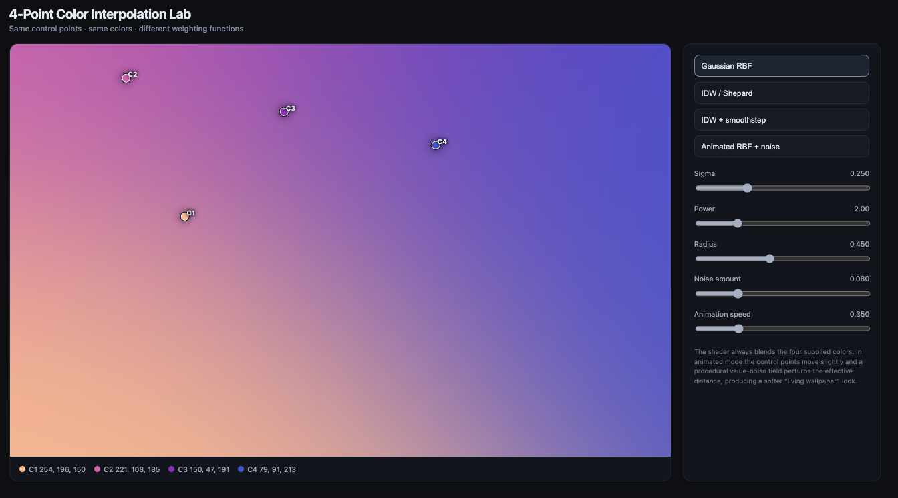

Color Interpolation in WebGL
WebGL-based color interpolation playground to compare several distance-based interpolation methods:

Gaussian RBF

$$
w_i = e^{-\frac{d_i^2}{2\sigma^2}}
$$

IDW / Shepard

$$
w_i = \frac{1}{d_i^p}
$$

IDW + Smoothstep

$$
w_i = 1 - \operatorname{smoothstep}(0, r, d_i)
$$

The final color is calculated as a normalized weighted average:

$$
C(P) = \frac{\sum_i w_i C_i}{\sum_i w_i}
$$

Experimenting with animated RBF + procedural noise to create a more organic, "living" gradient wallpaper effect.
